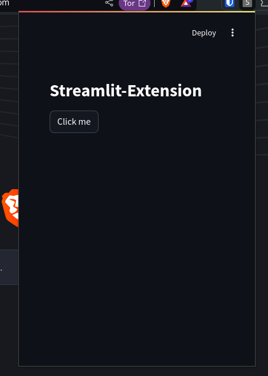

# App running on extension


# configure venv

```
python -m venv myvenv
source myvenv/bin/activate
pip install streamlit
```

# run app locally

```
streamlit run main.py
```

# add extension to chrome

- Navigate to chrome://extensions/
- Toggle the "Developer mode" switch on the top right corner.
- Click on the "Reload" button next to your extension.
- Click on the extension icon on the Chrome toolbar.


